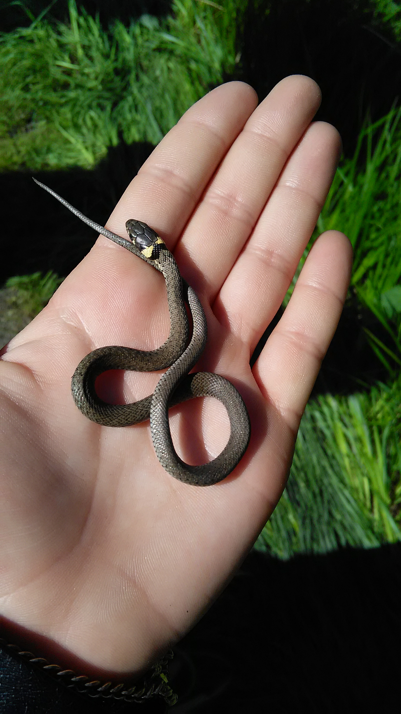
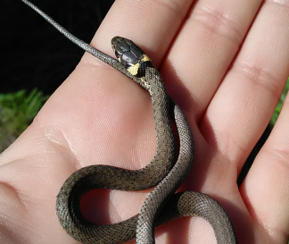
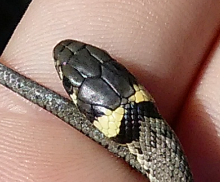
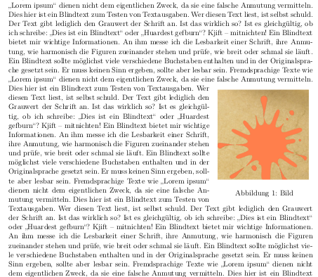
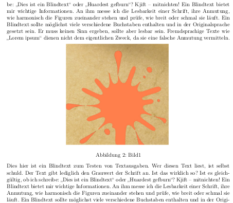
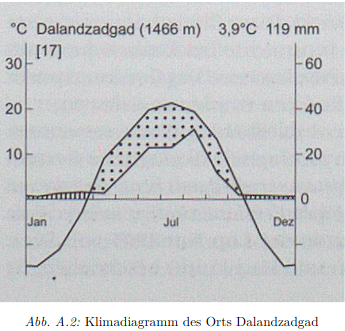
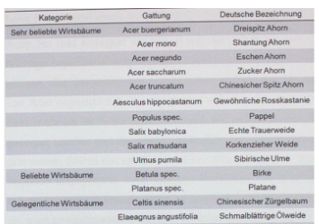
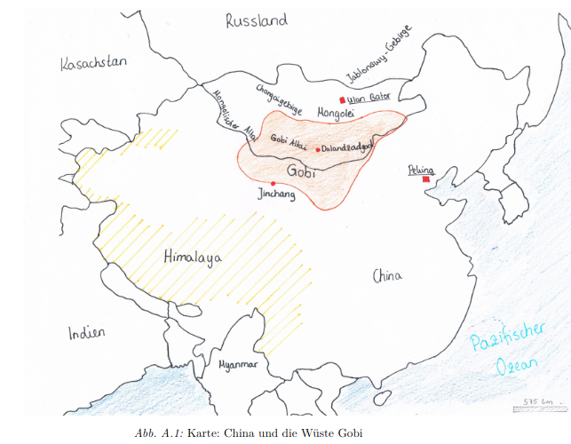

## Typische Fehler bei Bildern
::: {.notes}
* Bilder kann jeder - meint jeder
* Grußkarten sind keine wissenschaftlichen Arbeiten
* 
:::

* Falsche Größe und falscher Ausschnitt
* Falsche Platzierung
* Schlechte Qualität

---

### Größe und Ausschnitt

Bilder **vor** dem Einfügen in Endform bringen (Dokumentengröße)   
2MB vs. 393KB

{.absolute top="150" left="400" width="300px"}
 

{.absolute top="150" left="800" width="300px"}

---

Nur den wirklich relevanten Ausschnitt verwenden

{.absolute top="100" left="100" width="500px"}

.  .  .

{.absolute top="100" left="100" width="500px" height="421px"}

---

### Position

{.absolute top="100" left="100"}

{.absolute top="100" left="600"}

---

### Qualität ist wichtig!

{.absolute top="100" left="100"}

---

### Qualität ist wichtig!

{.absolute top="100" left="100" width="500px"}

---

### Qualität ist wichtig!

{.absolute top="100" left="100"}

---

### Weitere Tipps

* Arbeite nie mit dem Original!
* Auch Bilder sind Quellen
* Abbildungsverzeichnis $\neq$ Quellenverzeichnis
* Beachte die Lizenz des Bildes! 
