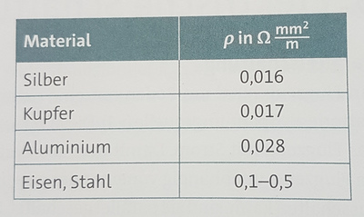
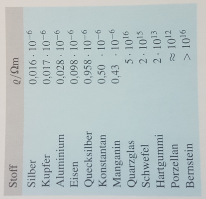
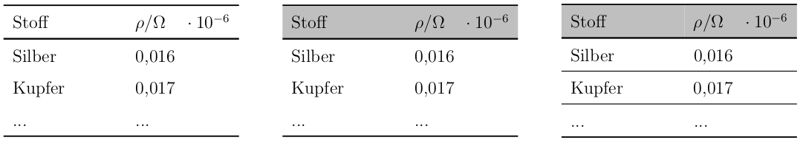

# Diagramme und Tabellen

::: {.notes}
Ist ein Screenshot eines Diagramms ein Bild?  
Gute Diagramm / Tabellen sind ein eigenes Thema
:::

Thema extrem fachspezifisch.  
Generell: Wenn möglich selbst erstellen

---

Schulbuch und Universität

{.absolute top="150" left="150"}
{.absolute top="150" left="600"}

---

### Varianten  

{.absolute top="250" left="150"}

Vertikale Linien sind unüblich

---