---

::: {.notes}
* Unterstrichen 
* Woher weiß man, mit was geschrieben wurde
* Word muss keine schlechten Ergebnisse liefern! Kann aber!
* Keine Punkte bei Kapiteln und Verzeichnissen
:::

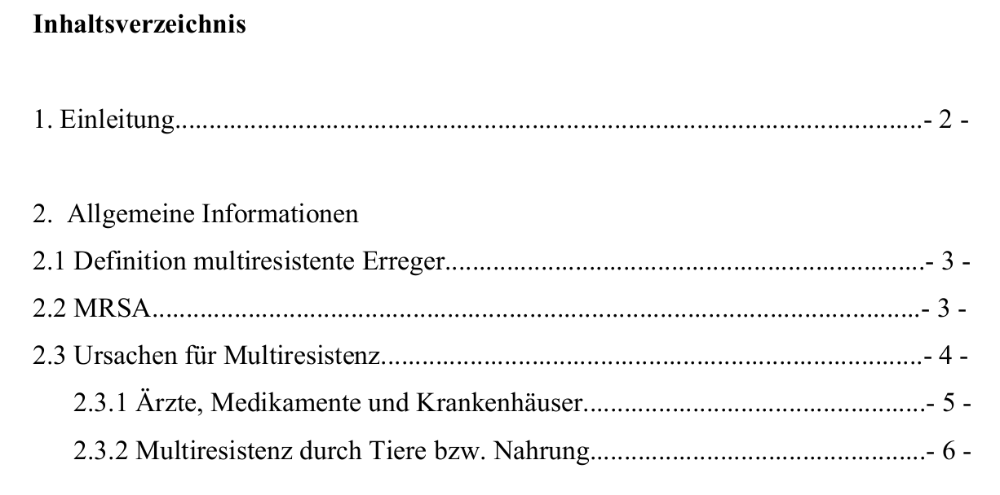{.absolute top="100" left="100"}

.  .  .

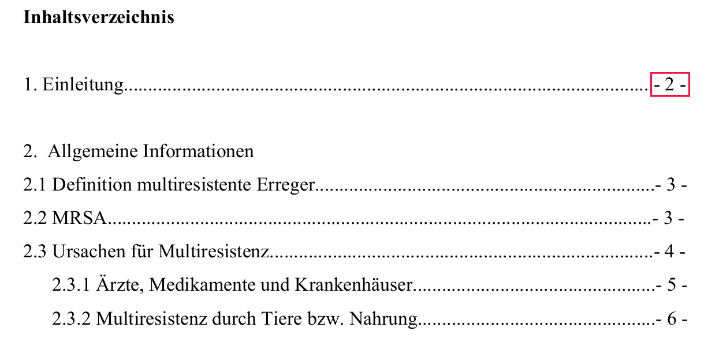{.absolute top="100" left="100"}

.  .  .

{.absolute top="100" left="100"}

.  .  .

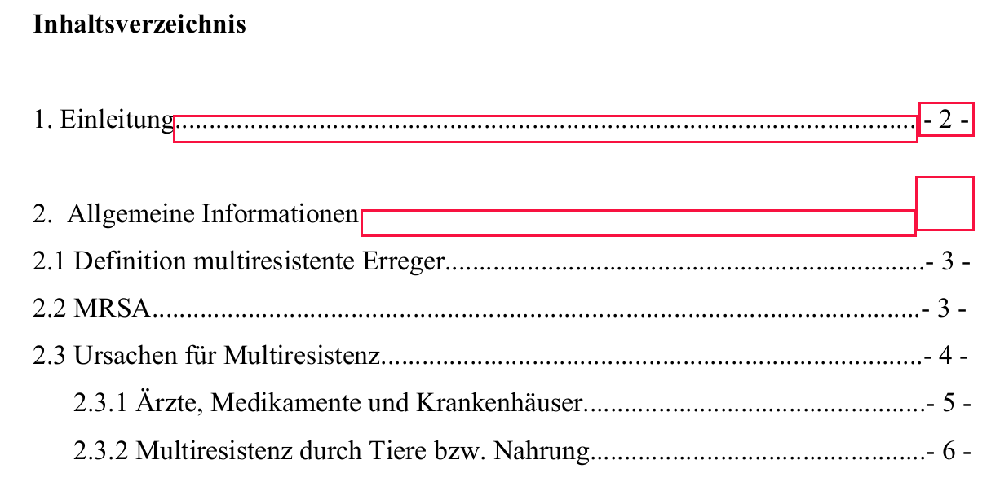{.absolute top="100" left="100"}

.  .  .

{.absolute top="100" left="100"}

.  .  .

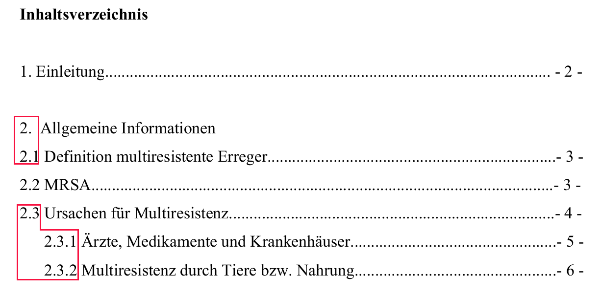{.absolute top="100" left="100"}

.  .  .

{.absolute top="100" left="100"}

.  .  .

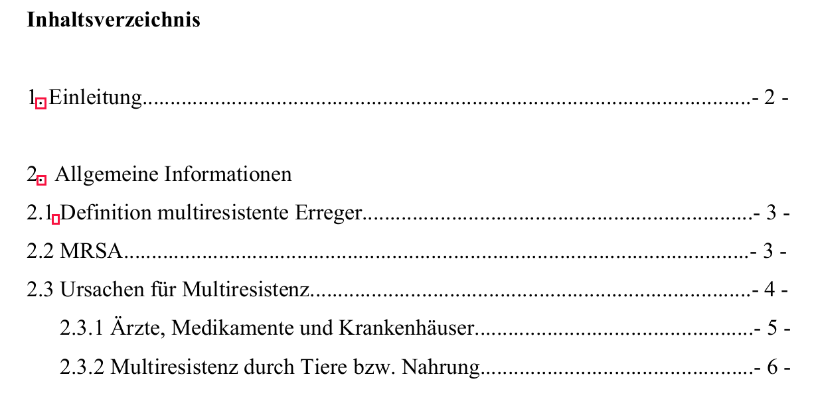{.absolute top="100" left="100"}

.  .  .

{.absolute top="100" left="100"}

##

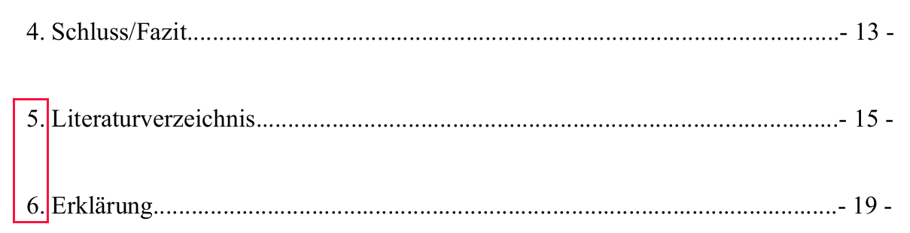{.absolute top="100" left="100"}

---

## Beispiele

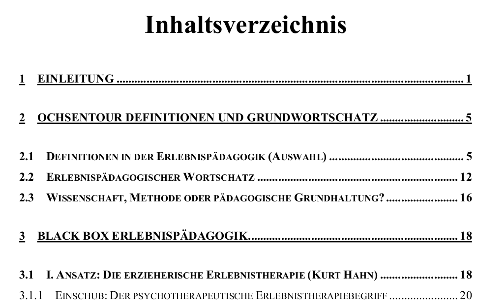{.absolute top="100" left="100"}

---

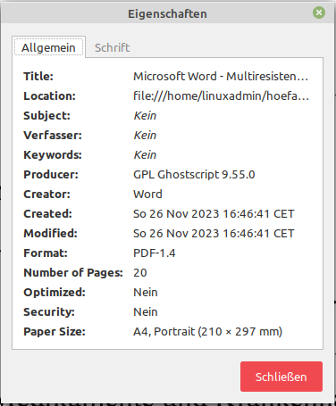{.absolute top="100" left="100"}

---

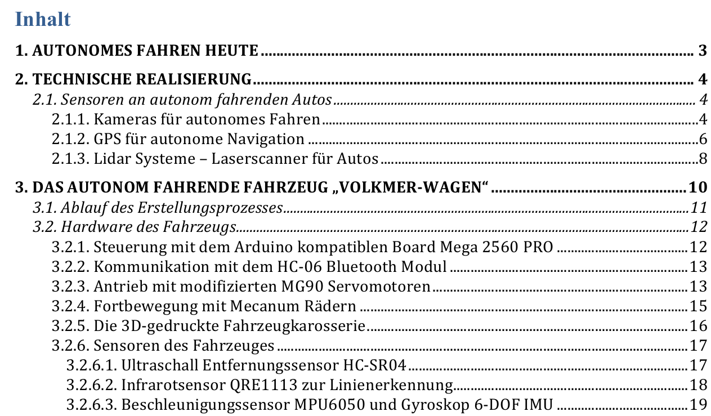{.absolute top="100" left="100"}

---

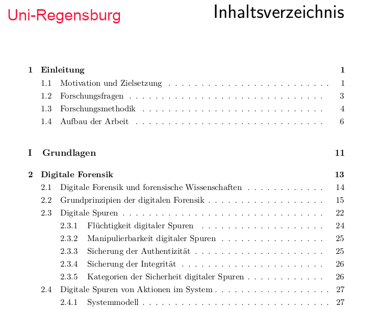{.absolute top="100" left="100"}

---

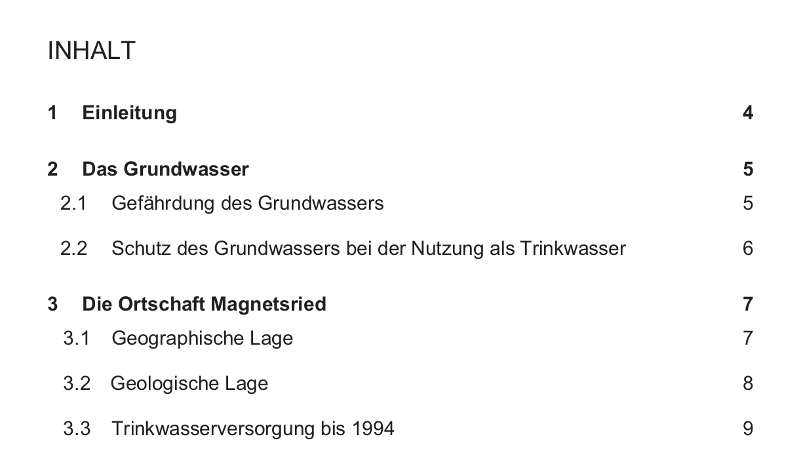{.absolute top="100" left="100"}

---

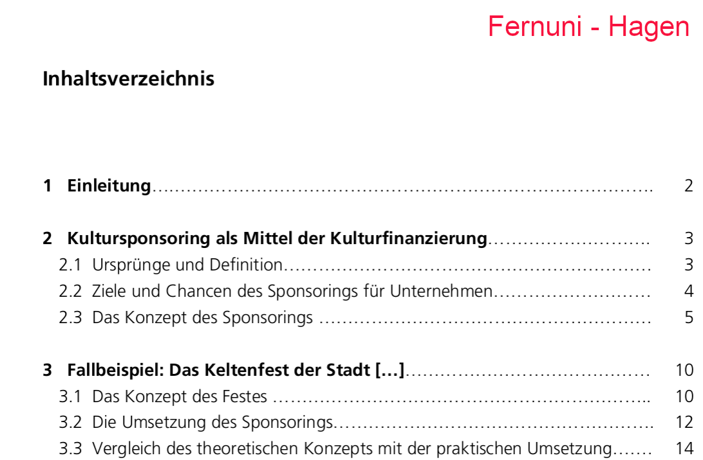{.absolute top="100" left="100"}

---

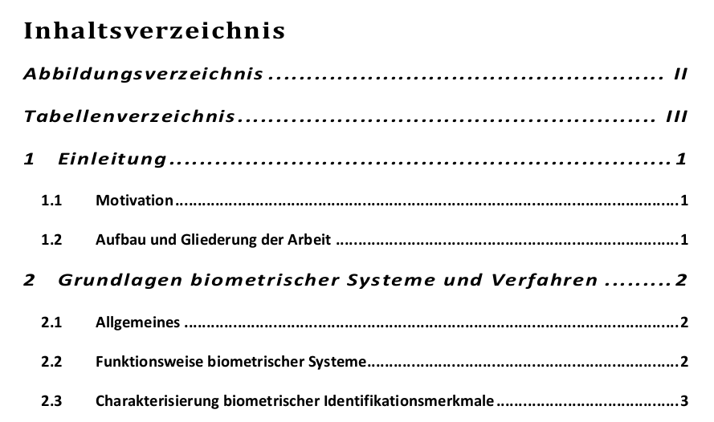{.absolute top="100" left="100"}

---

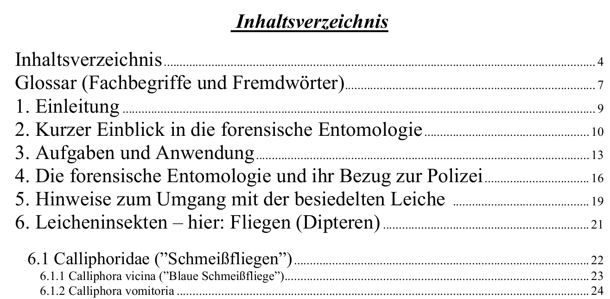{.absolute top="100" left="100"}

---

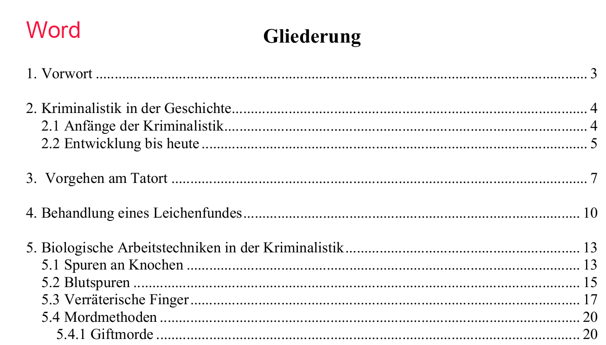{.absolute top="100" left="100"}

---