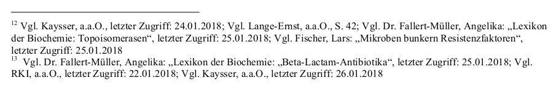
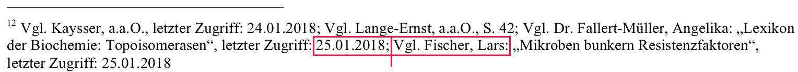
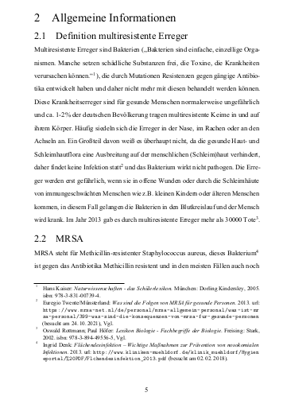
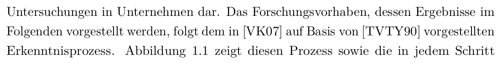

# Zitieren

## Zitieren bedeutet

* Kenntlichmachung von Textstellen als fremde Inhalte
* Angabe der Quelle

.  .  .

Aufgabe des Deutschunterrichts / Fachunterrichts

---

## Wohl die größte Herausforderung, denn 

* es gibt DIN-Normen,
* aber jeder Lehrer will es anders haben.  
* Oft schwer Automatismen anzupassen!

--- 

**Wichtig**  
Fertige für jeden Quelltyp ein Beispiel mit deinem
System an und lasse es vom Lehrer absegnen!  

**Tipp**  
Vielen Lehrern ist es egal, solange es einheitlich ist.

---

## Varianten:

* Fußnoten
* Endnoten

---  

# Nachteile von Fußnoten

## Hässlich wie die Nacht!

{.absolute top="150" left="100" }

---

## Fehleranfällig

{.absolute top="100" left="100"}

---

## Zerstört das Layout

{.absolute top="100" left="100"}

--- 

## Kompliziert

::: incremental
* Zitat „Huber“: Vollzitat
* Zitat „Huber“: ebd.
* Zitat „Maier“: Vollzitat
* Zitat „Huber“: Kurzzitat
:::

---

# Endnoten

In der Wissenschaft sehr gebräuchlich, im Englischen ebenfalls.

{.absolute top="250" left="100"}

# Quellenverzeichnis

(Heißt immer noch „Literaturverzeichnis“ ...)

Sollte nach Typ der Quelle gegliedert und dort alphabetisch sortiert sein.

Akademische Titel des Autors werden in der Regel **nicht** angegeben.
