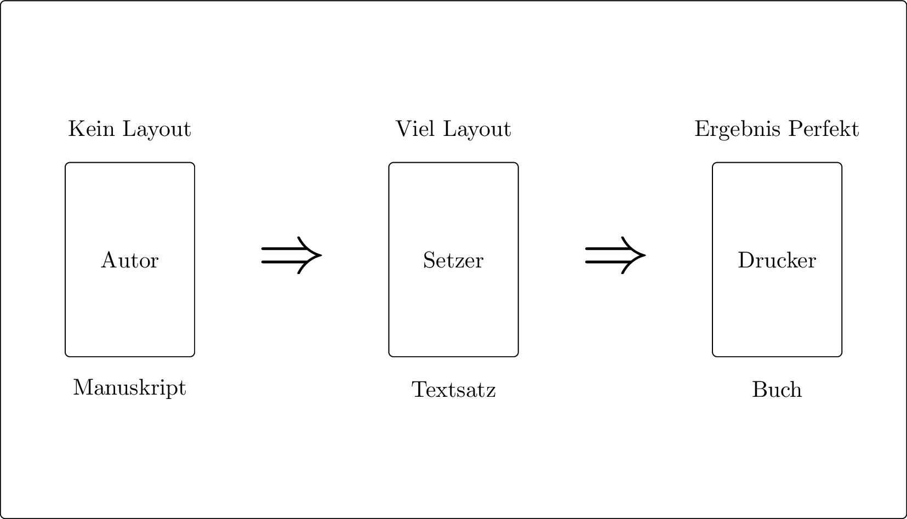
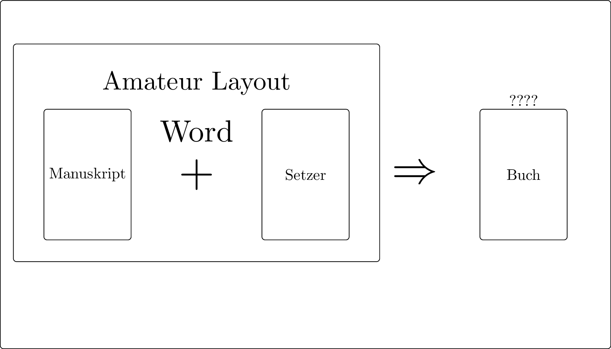
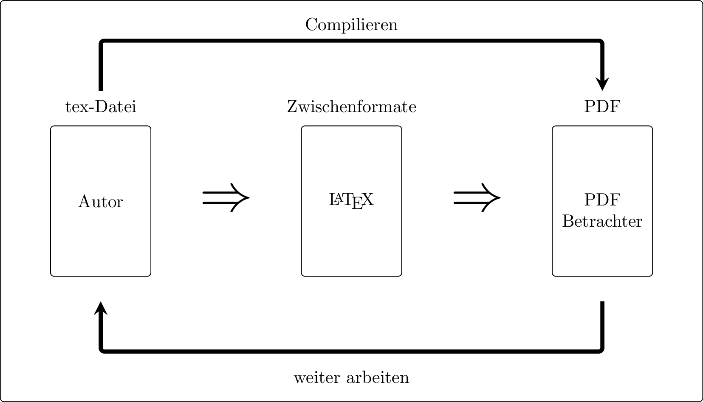
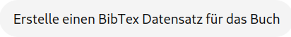

# Warum LaTeX?

Professionelle Texterstellung im wissenschaftlichen   
Umfeld erfolgt nicht mit Word.

---

**Verwendete Systeme**  

* Quarto
* Pandoc
* Typst
* $\LaTeX$
* Adobe InDesign << Einzig kostenpflichtige Software

---

## Verlage  

* Zerlegen und analysieren *docx*-Dateien, *odt*-Dateien, ... 
* Bauen den Text neu auf
* Wenden Layout an


---

Ein professionelles Dokument entsteht als Workflow

* Sammeln von Literatur
* Erstellen von Inhalten (Text)
* Vorbereiten von Bildern, Tabellen, Diagrammen
* ...
* Layout (Formatierung) erstellen

---

**LaTeX erledigt für dich**

* Automatische Nummerierungen
  - Fußnoten
  - Quellen
  - Abbildungen und Tabellen
  - Überschriften
  - Querverweise, Seitenbezüge
* Multi-Dokumenten-Management
* Literaturverzeichnis


## Wo ist LaTeX anstrengend?

* Steile Lernkurve - Konzept kapieren
* Nicht jeder Blödsinn möglich
* Man kann LaTeX-Fehler machen, nicht nur Rechtschreibfehler
* Die Rechtschreibprüfung, ... ist in Word besser
* Man lernt nie aus ...

---

# Wie funktioniert LaTeX?

## Ursprünglich

{.absolute left="100" top="120"}

## Heute

{.absolute left="100" top="120"}

## Ablauf mit LaTeX

{.absolute left="100" top="120"}
---

# Was ist ein Tex-Dokument?

---

Reiner Text + *Beschreibende Angaben*

```latex
\chapter{Einleitung}
Ziel dieser Arbeit ...  das ist \emph{wichtig}!
```

:::{.fragment}
Keine Angst ... es gibt einen ByCS-Kurs und eine Vorlage für eine Seminararbeit
:::

---

Bilder werden nur verlinkt, nicht ins Dokument geschrieben:

```latex
\begin{figure}[H]
   \centering
   \includegraphics[width=10cm]{bilder/zebra.png}
   \caption{Ein Zebra in der Savanne}
   \label{abb:zebra1}
\end{figure}

... Wie in Abbildung \ref{abb:zebra} auf Seite \pageref{abb:zebra} 
zu sehen ist, ...
```

---

## Zitieren ganz einfach -- Überblick

1. Buch finden
2. Eintrag in die Datenbank erstellen
3. Quellennachweis im Text erstellen
4. Den Rest macht LaTeX

---

## Zitieren ganz einfach -- Details

**Buch finden**

{.absolute top="120" left="50" width="300px"}

{.fragment .absolute top="50" left="500" width="700px"}


::: {.fragment .absolute .smaller top="130" left="520"}
Ja
:::

{.fragment .absolute top="190" left="500" width="500px"}

::: {.fragment .absolute .smaller top="270" left="520"}
Für das Buch Let's Code Python von Hauke Fehr  
kannst du folgenden BibTeX-Eintrag verwenden  
(basierend auf der 4. Auflage von 2022)
:::

::: {.fragment .absolute  top="270" left="520"}
```latex
@book{fehr2022,   <<<< DAS ist der Zitierschlüssel
  author    = {Hauke Fehr},
  title     = {Let's Code Python},
  subtitle  = {Programmieren lernen mit Python und vielen Projekten},
  edition   = {4},
  year      = {2022},
  publisher = {Rheinwerk Verlag},
  address   = {Bonn},
  isbn      = {978-3-8362-6514-0}
}
```
:::

---

## Im Dokument

```latex
Im Unterricht verwenden wir das Buch von Hauke Fehr „Let's Code  
Python“\footcite{fehr2022}. Beachte besonders das Kapitel über 
Grundlagen\footcite[vgl.][42-55]{fehr2022}
```

:::{.fragment}
Den gesamten Rest -- Fußnote + Quellenverzeichnis macht LaTeX
automatisch richtig nach Voreinstellung.
:::

## Tabellen und Diagramme

Das für euch komplexestes Thema -- auch hier KI hilfreich.  
Thema für eigenen Workshop.

# Woher bekomme ich LaTeX?

* Lokale Installation (dauert relativ lange, ist ziemlich umfangreich)
* Installation auch USB-Stick (etwas langsamer im Betrieb)
* Online-Plattform Overleaf (kostenlos inzwischen fast unbenutzbar)
* Ohne Garantien -- mein eigener Server

# Wo erfahre ich mehr über LaTeX?


